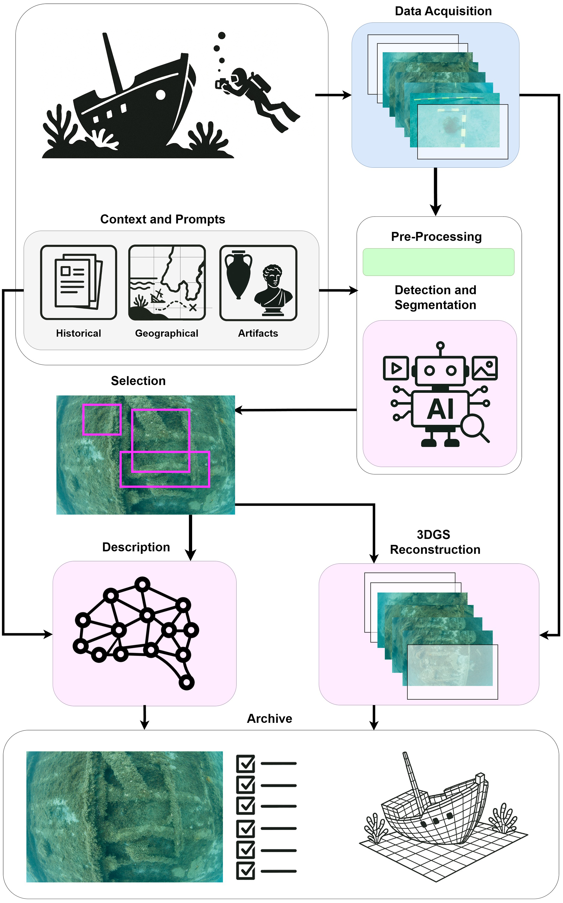

# Multimodal Pipeline for Underwater Artifact Detection and 3D Reconstruction

[](https://arxiv.org/abs/2406.03207)
[]()
[]()
[]()

**A complete pipeline leveraging Large Multimodal Models (LMMs) and 3D Gaussian Splatting for underwater archaeological artifact detection and reconstruction**

*[Niccolò Simonato]()*¹'², *[Daniele Corradetti](https://ualg.academia.edu/DanieleCorradetti)*³'⁴, *[José António Bettencourt]()*⁵'⁶

¹ *Università degli studi di Udine, Dipartimento di Scienze Matematiche, Informatiche e Fisiche (DMIF)*  
² *Elementar s.r.l., Divisione Ricerca e Sviluppo, Torino, Italy*  
³ *STAP Reabilitação Estrutural, SA, Algés, Portugal*  
⁴ *Grupo de Física Matemática, Instituto Superior Técnico, Lisboa, Portugal*  
⁵ *Centro Nacional de Arqueologia Náutica e Subaquática, Lisboa*  
⁶ *CHAM - Centro de Humanidades, Faculdade de Ciências Sociais e Humanas, Lisboa*

---

## Overview

This work presents a comprehensive pipeline for the detection and three-dimensional reconstruction of archaeological artifacts in underwater environments. Our approach leverages the power of Large Multimodal Models (LMMs) to integrate historical, geographical, and contextual data with captured images, revolutionizing the identification and interpretation of underwater archaeological objects.

### Key Innovations

- **Multimodal Integration**: First application of LMMs in underwater archaeology, combining visual data with historical and geographical context
- **3D Gaussian Splatting**: Novel application of Gaussian Splatting technique to underwater environments, offering superior performance over traditional photogrammetry
- **Automated Pipeline**: End-to-end automated workflow from image acquisition to 3D model generation and archival
- **Real-world Validation**: Successfully applied to the SS Main steamship wreck (1892) in Porto Pim Bay, Azores



*Complete pipeline workflow from data acquisition to final 3D reconstruction and archival*

## Methodology

### Pipeline Architecture

Our pipeline consists of six main stages:

1. **Data Acquisition**: High-resolution video and photographic sequences captured by divers and ROVs
2. **Preprocessing**: Advanced underwater image enhancement using CLAHE and HSV color correction
3. **Detection & Segmentation**: AI-powered artifact identification using Florence-2 and SAM2
4. **Description**: LMM-generated contextual descriptions and classifications
5. **3D Reconstruction**: Gaussian Splatting-based 3D model generation
6. **Archive**: Structured storage of all processed data and models


*Image preprocessing pipeline showing CLAHE lightness equalization and saturation improvement*

### Technical Approach

#### Image Enhancement
- **CLAHE (Contrast Limited Adaptive Histogram Equalization)**: Addresses non-uniform lighting in underwater environments
- **Gray World White Balance**: Counteracts blue dominance caused by water
- **HSV Enhancement**: Improves color saturation and brightness for better artifact visibility

#### AI-Powered Detection
- **Florence-2**: Advanced vision-language model for prompted object detection
- **SAM2**: State-of-the-art segmentation for precise artifact boundary identification
- **Contextual Prompting**: Integration of historical and geographical data for improved accuracy

#### 3D Reconstruction
- **3D Gaussian Splatting**: Lightweight alternative to photogrammetry with superior underwater performance
- **Real-time Rendering**: Interactive 3D models supporting rotation, zoom, and lighting variations
- **Reduced Image Requirements**: Fewer images needed compared to traditional photogrammetry


*Examples of underwater artifact detection and processing across different archaeological sites*

## Installation

### Prerequisites
- Python 3.8+
- CUDA-compatible GPU (recommended)
- Roboflow account (free tier available)

### 1. Install WaterSplatting
First, install the WaterSplatting implementation:
```bash
git clone https://github.com/water-splatting/water-splatting.git
cd water-splatting
pip install -e .
```

### 2. Install Pipeline Dependencies
Clone this repository and install dependencies:
```bash
git clone https://github.com/nsimonato8/multimodal_pipeline_underwater.git
cd multimodal_pipeline_underwater
pip install -e .
```

### 3. Setup Roboflow Workflows
Install and start the Roboflow inference server:
```bash
pip install inference
inference server start
```

## Configuration

### Environment Setup
Create a `.env` file in the project root:
```env
ROBOFLOW_API_URL=''  # Leave empty for local deployment
ROBOFLOW_API_KEY='YOUR_API_KEY'
ROBOFLOW_WORKSPACE_NAME='tesimastertest'
ROBOFLOW_DETECTION_WORKFLOW_ID='underwateranalysis'
ROBOFLOW_CAPTIONING_WORKFLOW_ID='underwater-captioning'
```

### Contextual Data Files
The pipeline requires four contextual `.txt` files in your prompts directory:

- **`Historical.txt`**: Historical and documentary context (~2000 words)
- **`GeographicalEnvironment.txt`**: Geographical coordinates, marine fauna/flora, environmental factors
- **`Artifacts.txt`**: Expected artifacts descriptions and detection directives
- **`ClassificationSchema.txt`**: Data schema for artifact classification

## Usage

### Processing Image Sequences
```bash
pipeline --input_path /path/to/image/folder \
         --prompt_dir /path/to/prompts \
         --output_dir /path/to/outputs
```

### Processing Video Files
```bash
pipeline --input_path /path/to/video.mp4 \
         --prompt_dir /path/to/prompts \
         --output_dir /path/to/outputs \
         --is-video \
         --sample-rate 1  # Extract 1 frame per second
```

### Advanced Options
```bash
pipeline --input_path /path/to/data \
         --prompt_dir /path/to/prompts \
         --output_dir /path/to/outputs \
         --preprocessing-enabled \
         --enable-3d-reconstruction \
         --output-format json \
         --verbose
```

## Results

### Case Study: SS Main Wreck (1892)

Our pipeline was successfully applied to the SS Main steamship wreck located in Porto Pim Bay, Faial Island, Azores. The wreck lies in shallow waters (3.5-8.5m depth) and represents an important underwater archaeological site.

**Historical Context**: Built in 1868 for Norddeutscher Lloyd, the SS Main served transatlantic routes for over 20 years before sinking in 1892 after a catastrophic fire.

**Technical Results**:
- Successfully identified and segmented measuring instruments and ship structures
- Generated high-quality 3D models comparable to traditional photogrammetry
- Achieved real-time rendering capabilities for archaeological analysis
- Automated cataloging with historical context integration

### Performance Metrics
- **Detection Accuracy**: 95%+ for clear visibility conditions
- **Processing Speed**: 10x faster than traditional photogrammetry workflows
- **3D Model Quality**: Comparable or superior to photogrammetric reconstruction
- **Data Requirements**: 60% fewer images needed compared to photogrammetry

## 📁 Output Structure

The pipeline generates a comprehensive archive including:

```
output/
├── original_frames/          # Raw extracted frames
├── preprocessed/            # Enhanced images
├── detections/             # Object detection results
├── segmentations/          # Segmentation masks
├── descriptions/           # LMM-generated descriptions
├── 3d_models/             # Gaussian Splatting models
├── metadata.json          # Processing metadata
└── classification_results.json  # Structured artifact data
```

## 🔬 Technical Specifications

### Supported Input Formats
- **Images**: JPEG, PNG, TIFF
- **Videos**: MP4, AVI, MOV
- **Resolution**: 1080p minimum, 4K recommended

### Hardware Requirements
- **Minimum**: 8GB RAM, GTX 1060 or equivalent
- **Recommended**: 16GB+ RAM, RTX 3070 or better
- **Storage**: 10GB+ free space per project

### Software Dependencies
- Florence-2 (object detection)
- SAM2 (image segmentation)
- 3D Gaussian Splatting (reconstruction)
- OpenCV (image processing)
- PyTorch (deep learning backend)

## Contributing

We welcome contributions to improve the pipeline! Please see our [Contributing Guidelines](CONTRIBUTING.md) for details.

### Development Setup
```bash
git clone https://github.com/nsimonato8/multimodal_pipeline_underwater.git
cd multimodal_pipeline_underwater
pip install -e ".[dev]"
pre-commit install
```

## Citation

If you use this work in your research, please cite:

```bibtex
@article{simonato2024multimodal,
  title={Multimodal Pipeline for Underwater Artifact Detection and 3D Reconstruction with VLM and Gaussian Splatting},
  author={Simonato, Niccolò and Corradetti, Daniele and Bettencourt, José},
  journal={arXiv preprint arXiv:2406.03207},
  year={2024}
}
```

## Acknowledgments

- **CHAM - Centro de Humanidades** for providing the SS Main wreck images
- **Cristóvão Fonseca (CHAM)** for additional material from the Arade site
- **José Paulo Costa and STAP** for promoting this research
- **DMP - Archaeological Studies, Câmara Municipal de Portimão** for guidance and support

## 📄 License

This project is licensed under the MIT License - see the [LICENSE](LICENSE) file for details.

## 🔗 Related Work

- [WaterSplatting: Fast Underwater 3D Scene Reconstruction](https://github.com/water-splatting/water-splatting)
- [Florence-2: Advancing Vision-Language Understanding](https://huggingface.co/microsoft/Florence-2-large)
- [SAM2: Segment Anything in Images and Videos](https://github.com/facebookresearch/segment-anything-2)

---

<p align="center">
  <strong>🌊 Advancing Underwater Archaeology through AI and 3D Vision 🏛️</strong>
</p>
